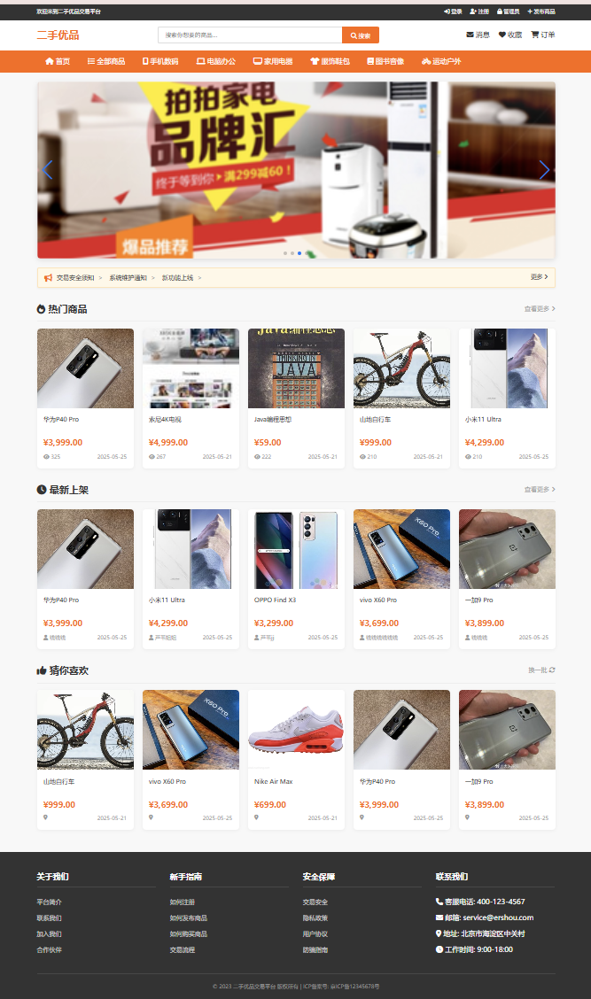

# 🛒 二手交易平台

基于SSM(Spring+SpringMVC+MyBatis)框架开发的校园二手物品交易系统，包含完整的前端展示和后台管理功能

## ✨ 功能亮点
- 用户系统：注册/登录/个人中心
- 商品管理：发布/搜索/收藏
- 交易流程：订单创建/确认/取消
- 消息系统：站内信/通知
- 管理员后台：用户管理/商品审核/数据统计/分类管理/公告管理

## 🛠 技术栈
| 模块       | 技术                     |
|------------|--------------------------|
| 前端       | Bootstrap + jQuery       |
| 后端       | Spring + SpringMVC + MyBatis |
| 数据库     | MySQL 8.0               |
| 安全       | MD5加密 + 权限验证       |
| 部署       | Tomcat 9                |

## 🚀 快速启动
1. 导入数据库：`/database/second_hand.sql`
2. 修改配置：`src/main/resources/jdbc.properties`
3. 使用Tomcat 9+部署

## 📸 界面预览
1.首页

2.管理员页面

3.个人中心

4.商品列表

5.商品详情

6.用户管理

7.商品管理

8.我的商品列表

